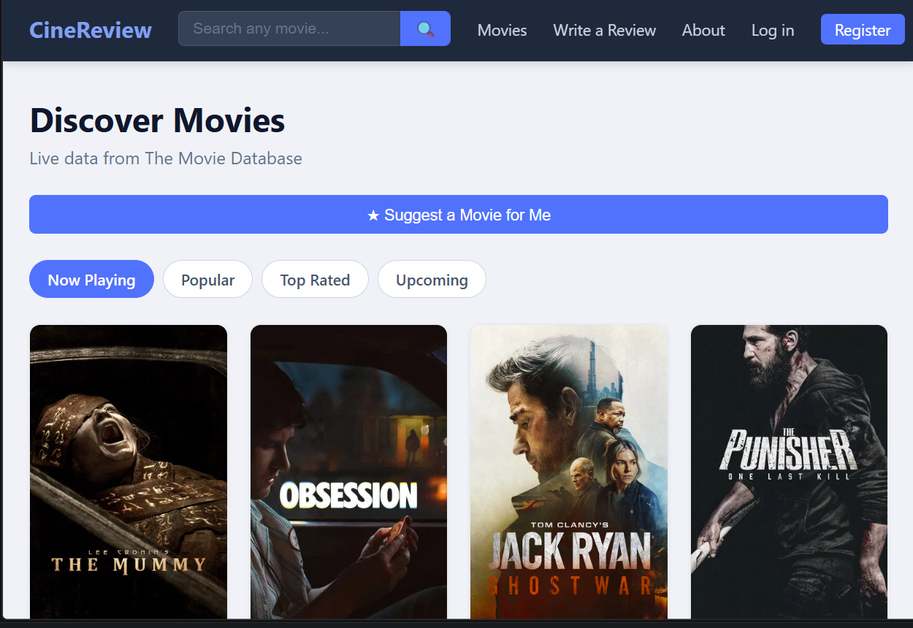
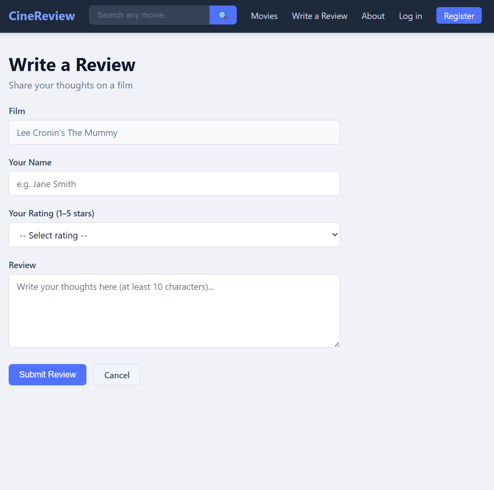
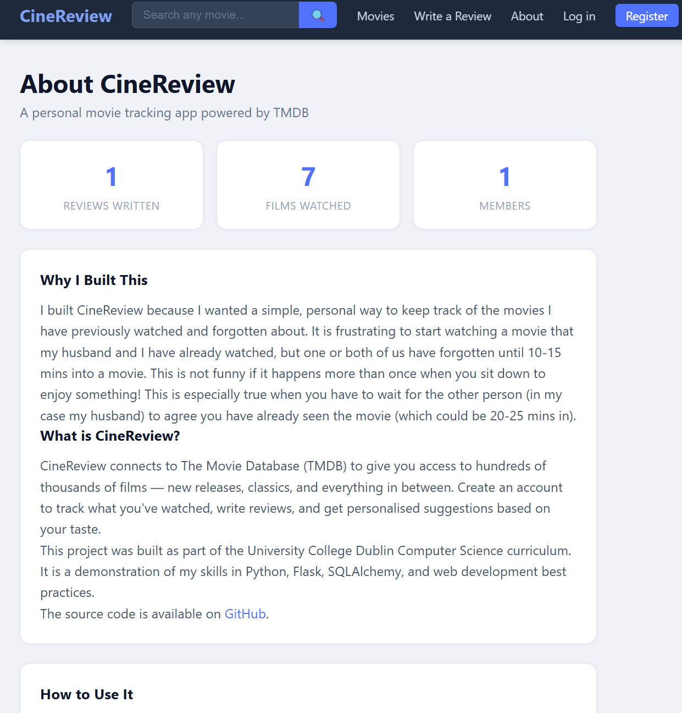
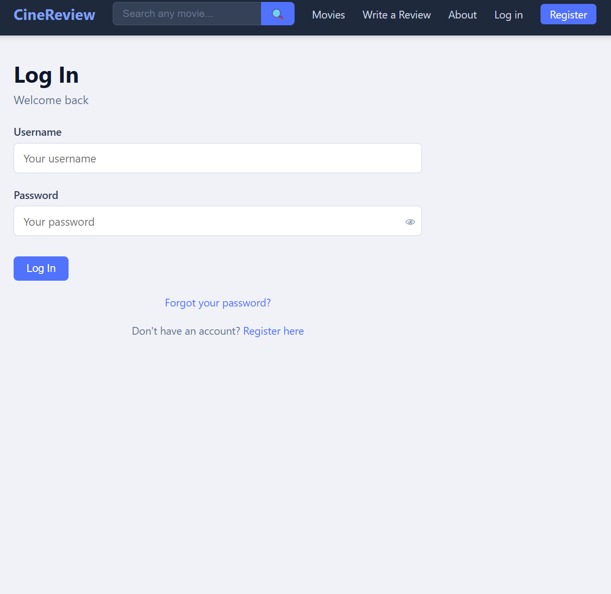
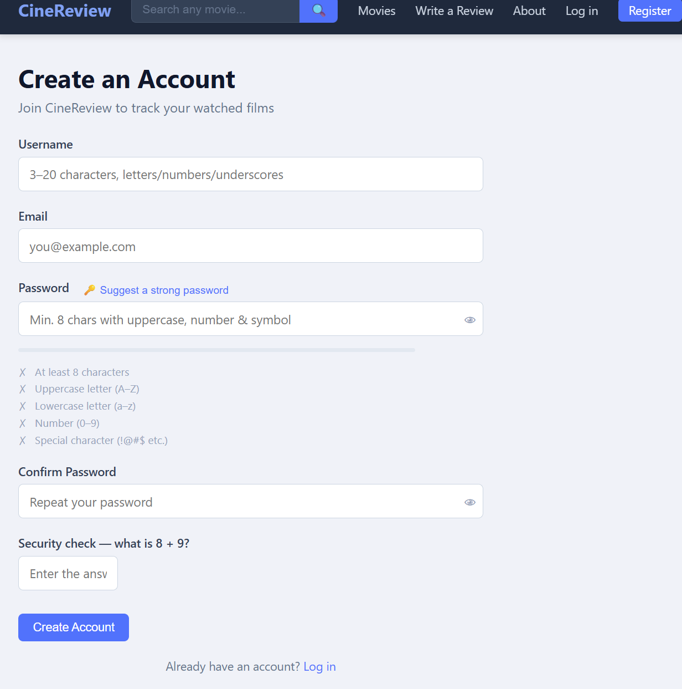

# CineReview

A Flask web application for discovering movies and writing reviews. Movie data is pulled live from [The Movie Database (TMDB)](https://www.themoviedb.org/), while user accounts and reviews are stored locally.

---

## The Idea

This project came from a very relatable problem — my husband and I could never remember which movies we had already watched together. We'd settle in, start a film, and about 10 minutes in one of us would say *"we've watched this"* or *"this is familiar..."*.

CineReview was built to solve exactly that: a simple way to log the movies you've watched so you never have to sit through the first 10 minutes of a film you've already seen.

---

## Features

- Browse movies by category: Now Playing, Popular, Top Rated, Upcoming
- Search for any film via TMDB
- Read and write reviews (1–5 star rating + comment)
- Mark movies as watched and view your personal watched list
- Personalised suggestions based on your last watched film
- Filter suggestions by **genre**, **decade** (1970s–2020s), **age rating** (Little Ones / Kids / Tweens), and **origin** (French, Italian, Spanish, German, Korean, Japanese, Hindi) — all filters support multiple selections and can be combined
- Page through more suggestions without repeating films already watched or excluded
- Mark movies as **No Thanks** on the detail page to permanently hide them from the grid and suggestions
- **Reviewed** button on each film page — changes to a muted indigo state once a logged-in user has submitted a review, preventing accidental duplicates
- Write a Review page shows up to 4 recently watched **unreviewed** films as a quick-pick grid; guests see a prompt to create an account
- **Rate This App** feedback card on the About page — star rating + comment sent directly to the site owner by email
- User accounts with registration, login, and password reset by email

---

## Project Structure

```
cinereview/
├── flask_app/
│   ├── app.py            # Application factory — wires Flask, extensions, and startup migrations
│   ├── config.py         # Environment-based configuration (database URL, mail, secret key)
│   ├── extensions.py     # Flask extension instances (db, mail, login_manager)
│   ├── models.py         # SQLAlchemy database models (User, Review, WatchedMovie, etc.)
│   ├── routes.py         # All URL routes and view functions
│   ├── utils.py          # Helper functions (email sending, password validation, CAPTCHA, tokens)
│   ├── tmdb.py           # Wrapper functions for the TMDB API
│   ├── requirements.txt  # Python dependencies
│   ├── Procfile          # Tells Render how to start the app in production
│   ├── templates/        # HTML templates (Jinja2)
│   │   ├── base.html     # Shared layout — navbar, head, footer
│   │   ├── index.html    # Home page
│   │   ├── movie.html    # Individual film page
│   │   ├── add_review.html
│   │   ├── my_movies.html
│   │   ├── search.html
│   │   ├── register.html
│   │   ├── login.html
│   │   ├── forgot_password.html
│   │   ├── reset_password.html
│   │   ├── about.html
│   │   └── 404.html
│   └── static/
│       └── style.css     # All site styles
```

---

## How Templates Work

All pages inherit from `base.html` using Jinja2's template inheritance system:

```html

```

This means `base.html` defines the shared structure (navbar, `<head>` tags, CSS links) once, and every other page slots its unique content into named blocks:

```html

  <!-- page-specific HTML goes here -->

```

This way, changes to the navbar or layout only need to be made in one place.

### Comment syntax across file types

Each file type uses its own comment syntax:

| File type | Syntax | Notes |
|-----------|--------|-------|
| Python (`.py`) | `# comment` | Processed by Python; never sent to the browser |
| Jinja2 templates (`.html`) | `{# comment #}` | Stripped by Jinja2 before HTML is sent to the browser |
| HTML | `<!-- comment -->` | Sent to the browser and visible in "View Source" |
| CSS (`.css`) | `/* comment */` | Sent to the browser but ignored by the rendering engine |

Jinja2's `{# #}` is preferred over HTML `<!-- -->` inside templates because it never reaches the user's browser.

---

## Screenshots

### Home Page — Browse by Category


### Write a Review


### About Page


### Log In


### Create an Account


---

## Running Locally

1. **Clone the repo and create a virtual environment:**
   ```bash
   python -m venv .venv
   .venv\Scripts\activate      # Windows
   source .venv/bin/activate   # Mac/Linux
   ```

2. **Install dependencies:**
   ```bash
   pip install -r flask_app/requirements.txt
   ```

3. **Set environment variables** — copy `.env.example` to `.env` and fill in your values:
   ```
   TMDB_API_KEY=your_tmdb_api_key
   SECRET_KEY=any_random_secret_string
   MAIL_USERNAME=your_gmail_address      # optional — only needed for password reset emails
   MAIL_PASSWORD=your_gmail_app_password # optional — only needed for password reset emails
   ```

4. **Run the app:**
   ```bash
   cd flask_app
   flask run
   ```
   Then open `http://localhost:5000` in your browser.

   The database tables are created automatically on first startup — no migration commands needed.

5. **Enable debug mode (optional but recommended during development):**
   ```bash
   flask --debug run
   ```
   Or set the environment variable before running:
   ```bash
   $env:FLASK_DEBUG = "1"   # PowerShell
   flask run
   ```

   Debug mode enables:
   - **Auto-reloader** — Flask restarts automatically whenever you save a `.py` file
   - **Interactive debugger** — exceptions show a full traceback in the browser with a console to inspect variables
   - **Detailed error pages** — instead of a generic 500 page you see exactly what went wrong and where

   > **Never enable debug mode in production.** Render runs Gunicorn rather than Flask's dev server, so debug mode does not apply there regardless.

---

## Running the Tests

The project has an automated test suite that verifies every major route, form, database operation, API endpoint, page content, and accessibility requirement. Tests run in seconds and require no internet connection — all calls to the TMDB movie API are intercepted automatically.

### Install test dependencies

```bash
cd flask_app
python -m pip install -r requirements-dev.txt
```

### Run the full suite

```bash
python -m pytest tests/ -v
```

> Use `python -m pytest` rather than just `pytest` to ensure the command runs inside the correct virtual environment.

### What a passing run looks like

```
tests/test_routes.py::TestPublicRoutes::test_home_page_returns_200 PASSED
tests/test_routes.py::TestRegistration::test_valid_registration_creates_user PASSED
...
75 passed in 7.55s
```

### What the tests cover

| Area | Tests |
|---|---|
| Public routes (home, search, movie detail, about) | 9 |
| Registration (valid, duplicate, weak password, CAPTCHA, honeypot) | 8 |
| Authentication (login, logout, wrong credentials) | 5 |
| Access control (unauthenticated redirects) | 3 |
| Watch tracking (toggle watched, my movies) | 3 |
| Movie exclusion (No Thanks toggle) | 2 |
| Reviews (valid submission, validation errors) | 5 |
| Suggestions API (filters, exclusions) | 9 |
| Mobile (viewport meta tag) | 1 |
| Page content verification (key elements on every page) | 14 |
| Accessibility (WCAG 2.1 AA — skip nav, ARIA, landmarks) | 6 |
| Forgot password (form, email dispatch, rate limiting) | 5 |
| Reset password (valid token, expired token, password rules) | 5 |

### Test reports — generated automatically on every run

Three artefacts are written to `flask_app/test-reports/` after every run:

| Artefact | Purpose |
|---|---|
| `report_YYYY-MM-DD_HH-MM-SS.html` | Full HTML test report — open in a browser to review pass/fail detail, durations, and timestamps |
| `test_history.log` | Running audit trail — one line per run showing date, result, and pass rate |
| `anomaly_YYYY-MM-DD_HH-MM-SS.txt` | Generated **only on failure** — lists each failed test with full traceback and recommended action |

The history log references the anomaly filename when failures occur, providing complete traceability:

```
2026-06-02 11:37:17 | FAIL | 74/75 passed | 1 FAILED | See: anomaly_2026-06-02_11-37-17.txt
2026-06-02 11:39:48 | PASS | 75/75 passed
```

> `test-reports/` is listed in `.gitignore` and is never committed to the repository.

### What still needs manual testing

Some things cannot be verified automatically — visual layout, email delivery, JavaScript behaviour, and cross-browser compatibility. Full instructions for these are in [REQUIREMENTS.md](REQUIREMENTS.md) under **Manual Testing Guide**.

---

## Tech Stack

### Hosting & Infrastructure

| Tool | Role |
|---|---|
| [Render](https://render.com) | Hosts the Flask app as a Web Service |
| [Render PostgreSQL](https://render.com/docs/databases) | Production database |
| [GitHub](https://github.com/niamh888/cinereview) | Source control — Render deploys automatically on every push to `main` |
| [TMDB API](https://www.themoviedb.org/) | Movie data, posters, cast, and ratings |

### Python Dependencies

| Package | Purpose |
|---|---|
| Flask | Web framework |
| Flask-SQLAlchemy | Database ORM (SQLite locally, PostgreSQL in production) |
| Flask-Login | User session management |
| Flask-Mail | Sending password reset emails |
| requests | Making HTTP calls to the TMDB API |
| gunicorn | Production web server |
| psycopg2-binary | PostgreSQL driver for production |

---

## Deployment

The app is deployed and running live at:

**[https://cinereview-jik9.onrender.com](https://cinereview-jik9.onrender.com)**

> **Note:** hosted on Render's free tier — if the service has been idle, the first load may take up to 60 seconds to wake up. Subsequent pages load normally.

It is hosted on [Render](https://render.com) as a **Web Service** (not a static site — the app requires a running Python server and a PostgreSQL database).

### Render configuration

| Setting | Value |
|---|---|
| Service type | Web Service |
| Root directory | `flask_app` |
| Build command | `pip install -r requirements.txt` |
| Start command | `gunicorn app:app` |

The `Procfile` inside `flask_app/` defines the start command:

```
web: gunicorn app:app
```

### Environment variables

Set the following in the Render dashboard under the web service's **Environment** tab:

| Variable | Purpose |
|---|---|
| `SECRET_KEY` | Signs session cookies and password reset tokens |
| `TMDB_API_KEY` | Authenticates requests to the TMDB movie API |
| `DATABASE_URL` | Set automatically when a Render PostgreSQL database is linked |
| `MAIL_USERNAME` | Gmail address for sending password reset emails (optional) |
| `MAIL_PASSWORD` | Gmail app password (optional) |


### Database

A PostgreSQL database is provisioned separately on Render and linked to the web service via the `DATABASE_URL` environment variable. The app detects this variable at startup and switches from SQLite (local development) to PostgreSQL (production) automatically — no code changes required between environments.
